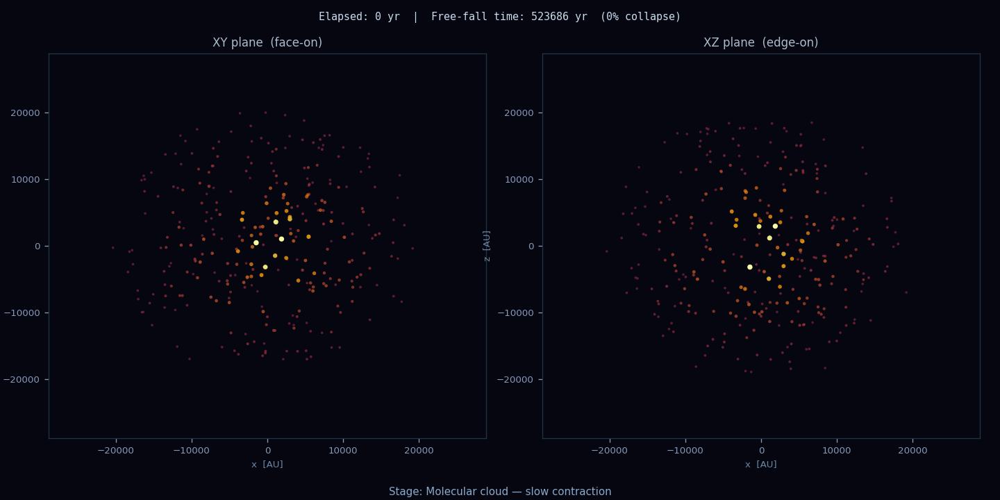

# Star Formation Simulation

A physics-based N-body simulation of gravitational collapse in a molecular cloud, visualizing the process of protostar formation.

**Author:** Eranjana Weerasinghe

## Overview

This simulation models how a cold gas cloud undergoes gravitational collapse to form a protostar. It uses a direct N-body integrator with softened gravity and the leapfrog (Störmer–Verlet) symplectic integrator to ensure energy conservation.

The visualization shows two orthogonal projections (face-on and edge-on) with particle colors and sizes representing local density, transitioning from a cold molecular cloud through various collapse stages until protostar formation.

## 📺 Animation Preview

<div align="center">



*Gravitational collapse of a 1 M☉ molecular cloud over ~120,000 years*

**Left:** Face-on view (XY plane) | **Right:** Edge-on view (XZ plane)

</div>

---

## Features

- **Physically accurate N-body gravity** with softening to handle close encounters
- **Symplectic integrator** (leapfrog) for energy conservation over long timescales
- **Real units** via Astropy (solar masses, parsecs, AU)
- **Dynamic visualization** showing density-dependent particle properties
- **Jeans instability analysis** with real-time Jeans length calculation and display
- **Stage labeling** tracking collapse progression (molecular cloud → protostar)

## Requirements

Install dependencies with:

```bash
pip install astropy matplotlib numpy
```

For video output, FFmpeg must be installed:
- **macOS:** `brew install ffmpeg`
- **Linux:** `apt-get install ffmpeg`
- **Windows:** Download from [ffmpeg.org](https://ffmpeg.org/download.html)

## Usage

Run the simulation:

```bash
python starformation.py
```

The script will:
1. Pre-compute 1080 frames of the gravitational collapse (~1 minute at 18 fps)
2. Generate an animation showing face-on (XY) and edge-on (XZ) views
3. Save output as `star_formation.mp4`

## Simulation Parameters

| Parameter | Value | Description |
|-----------|-------|-------------|
| Cloud mass | 1.0 M☉ | Total initial mass |
| Cloud radius | 0.1 pc ≈ 20,600 AU | Initial cloud size |
| Particles | 300 | Number of gas particles |
| Frames | 1080 | Animation frames (60 sec @ 18 fps) |
| Sound speed | 200 m/s | Pressure support parameter |
| Timestep | 0.012 × t_ff | Adaptive to free-fall time |

## Output

The animation displays:
- **Colors:** Inferno colormap (blue → orange → white) indicating density/temperature
- **Sizes:** Particle size scales with local density
- **Labels:** Real-time elapsed time and collapse percentage
- **Stage info:** Current evolutionary stage of the collapse
- **Jeans length:** Dynamic calculation showing λ_J and comparison with cloud radius
  - When cloud radius < Jeans length, gravitational instability drives collapse

## Physics

The simulation integrates the equations of motion using Newtonian gravity with softening:

$$\frac{d^2\mathbf{r}_i}{dt^2} = -G \sum_{j \neq i} \frac{m_j (\mathbf{r}_i - \mathbf{r}_j)}{(|\mathbf{r}_{ij}|^2 + \epsilon^2)^{3/2}}$$

Where ε is the softening length, preventing gravitational singularities.

## Jeans Instability

The simulation includes real-time **Jeans length** calculation to demonstrate gravitational instability:

$$\lambda_J = \sqrt{\frac{\pi c_s^2}{G \rho}}$$

Where:
- $c_s$ = sound speed (200 m/s for cold clouds)
- $G$ = gravitational constant  
- $\rho$ = local cloud density

**Physical interpretation:**
- When cloud radius **> Jeans length**: Pressure support dominates, cloud is stable
- When cloud radius **< Jeans length**: Gravity dominates, cloud collapses (Jeans instability)

As the simulation progresses, watch how the Jeans length decreases with increasing density, triggering and accelerating the collapse toward protostar formation.

## References

- Free-fall time: ~120,000 years for a 0.1 pc cloud at 1 M☉
- Based on Bonnor-Ebert sphere initial conditions
- Leapfrog integration: Springel et al. 2001, MNRAS 328, 726
